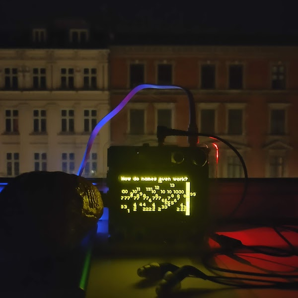

# wifihifi

Turn local wifis to music.

Here accompanied by [*Wireless Walnut* by Kristoffer
Ørum](http://www.oerum.org/projects/0096), an art piece which
transmits wireless text as SSID names.

Use `enc 2` to scan the wifis or toggle autoscanning with `key 3`. The
`key 2` refreshes the nearby wifis. The `enc 3` changes the tonality.
